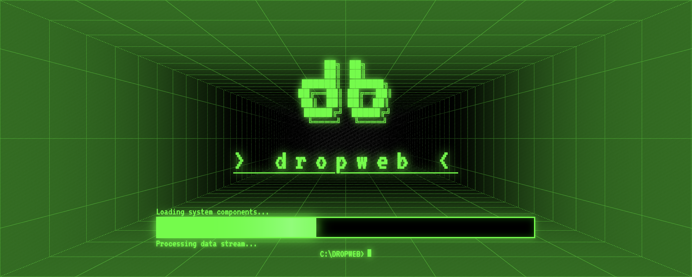
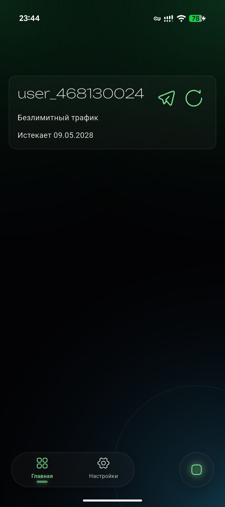
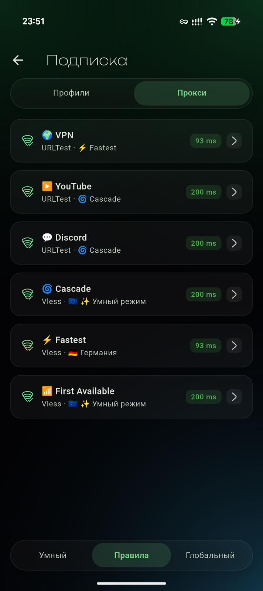

# dropweb

**Кроссплатформенный прокси-клиент** на ядре [mihomo](https://github.com/MetaCubeX/mihomo). Flutter UI, open-source.

[](https://github.com/enkinvsh/dropweb-app/releases)
[](https://github.com/enkinvsh/dropweb-app/releases)
[](https://github.com/enkinvsh/dropweb-app/releases)
[](LICENSE)
[](https://github.com/enkinvsh/dropweb-app/releases)

[English](README_EN.md) · [Скачать →](https://github.com/enkinvsh/dropweb-app/releases)

---

## Возможности

- **Протоколы**: VLESS, VMess, Trojan, Shadowsocks, Hysteria2, TUIC, WireGuard
- **Платформы**: Android 6+, Windows 10+, macOS 11+
- **Подписки**: автообновление, QR-код, URL импорт
- **Роутинг**: правила по домену, IP, GeoIP
- **UI**: тёмная тема, минималистичный дизайн

## Скриншоты

<table>
<tr>
<td></td>
<td></td>
</tr>
</table>

## Сборка

```bash
flutter pub get
dart run setup.dart android
```

## Лицензия

GPL-3.0 — см. [LICENSE](LICENSE).

---

<sub>Приложение не предназначено для обхода блокировок или нарушения законодательства РФ. Используйте для доступа к зарубежным AI-сервисам — ChatGPT, GPT-4, Claude, Gemini, Midjourney, Sora — удалённой работы, разработки и других легальных целей. Ответственность за использование несёт пользователь.</sub>
